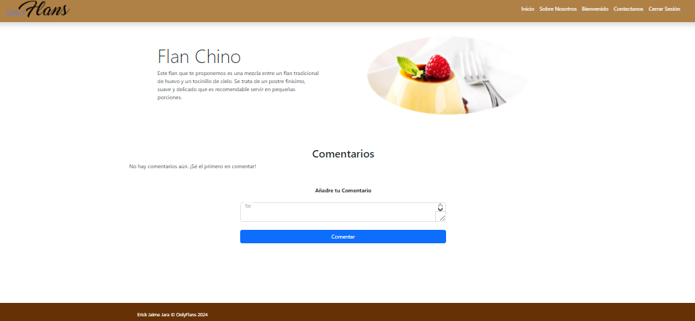
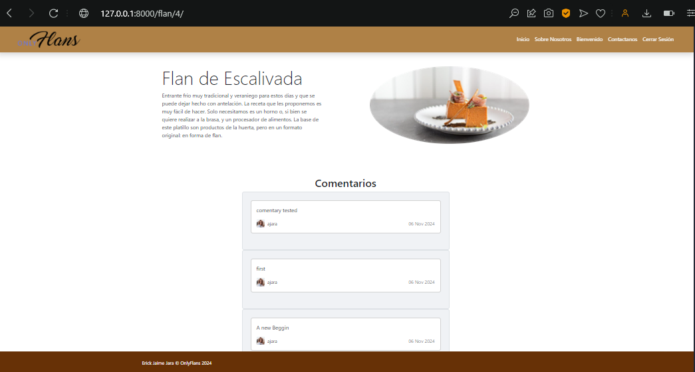

# OnlyFlans

## Descripción

OnlyFlans es un portal diseñado para la visualización de diferentes tipos de flanes. Los usuarios pueden explorar diversas opciones de flanes, ver detalles específicos de cada uno y, al estar autenticados, también pueden dejar comentarios sobre sus favoritos.

## Estructura de Ramas

El proyecto utiliza un sistema de control de versiones con ramas en Git para organizar el desarrollo. Cada hito o funcionalidad solicitada se implementa en ramas específicas. A continuación se detalla la estructura de ramas:

- **main**: Rama principal que contiene la versión actual del proyecto.
- **hito-1**: Rama dedicada al primer hito solicitado (Levantando tu primer proyecto Django).
- **hito-2**: Rama dedicada a la preparacion del frontend de la aplicacion.
- **hito-3**: Rama dedicada a la preparacion del backend, preparacion de formularios y nuevos modelos. 
- **hito-4**: Rama dedicada a la aplicacion de una nueva caracteristica y presentacion.

---

## Características Base del Sitio Web

- **Visualización de flanes:** Los usuarios pueden navegar por una lista de flanes, cada uno con su respectiva imagen y descripción.
- **Detalles del flan:** Al hacer clic en cada flan, se accede a una vista detallada con información más específica del mismo.
- **Autenticación de usuarios:** Los usuarios deben iniciar sesión para poder ver flanes privados y dejar comentarios.

---

## Características Personalizadas Añadidas al Sitio Web

- **Posibilidad de añadir comentarios:** Los usuarios autenticados pueden dejar comentarios en cada flan, permitiendo así compartir sus opiniones y experiencias. Esta funcionalidad incluye:
  - Un formulario de comentarios visible solo para usuarios autenticados.
  - Almacenamiento de los comentarios junto con el flan correspondiente y el usuario que lo escribió.

---

## Problemas o Dificultades Encontrados en el Desarrollo del Sitio Web Base

- **Ninguna dificultad relevante:** El desarrollo de las características básicas del sitio web se completó sin mayores inconvenientes.

---

## Problemas o Dificultades Encontrados al Añadir Características Personalizadas

- **Temas de Bootstrap:** Hubo algunas dificultades menores en la integración de elementos de Bootstrap, como el ajuste de estilos para mejorar la experiencia visual en las vistas detalladas de los flanes. Estas dificultades fueron resueltas con ajustes personalizados y el uso adecuado de las clases de Bootstrap.

---

## Instalación

Para configurar el proyecto en tu máquina local, sigue estos pasos:

1. Clona el repositorio:

   ```bash
    git clone https://github.com/DevilAbbath/onlyflansPrj/tree/hito3
    cd tu_repositorio

2. Crea y activa un entorno virtual:

   ```bash
    python -m venv env
    source env/bin/activate  # En Windows usa `env\Scripts\activate`

3. Instala las dependencias:

   ```bash
    pip install -r requirements.txt

4. Aplica las migraciones:

   ```bash
    python manage.py migrate


5. Ejecuta el servidor:

   ```bash
    python manage.py runserver

---

## Capturas de Pantalla



