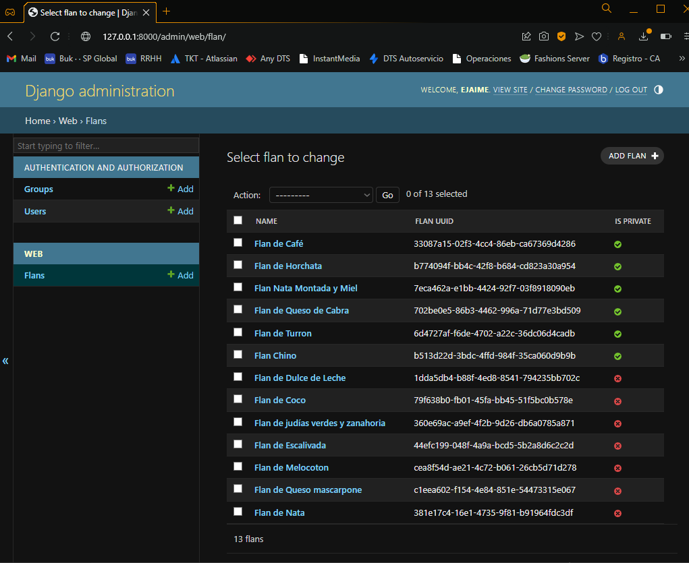
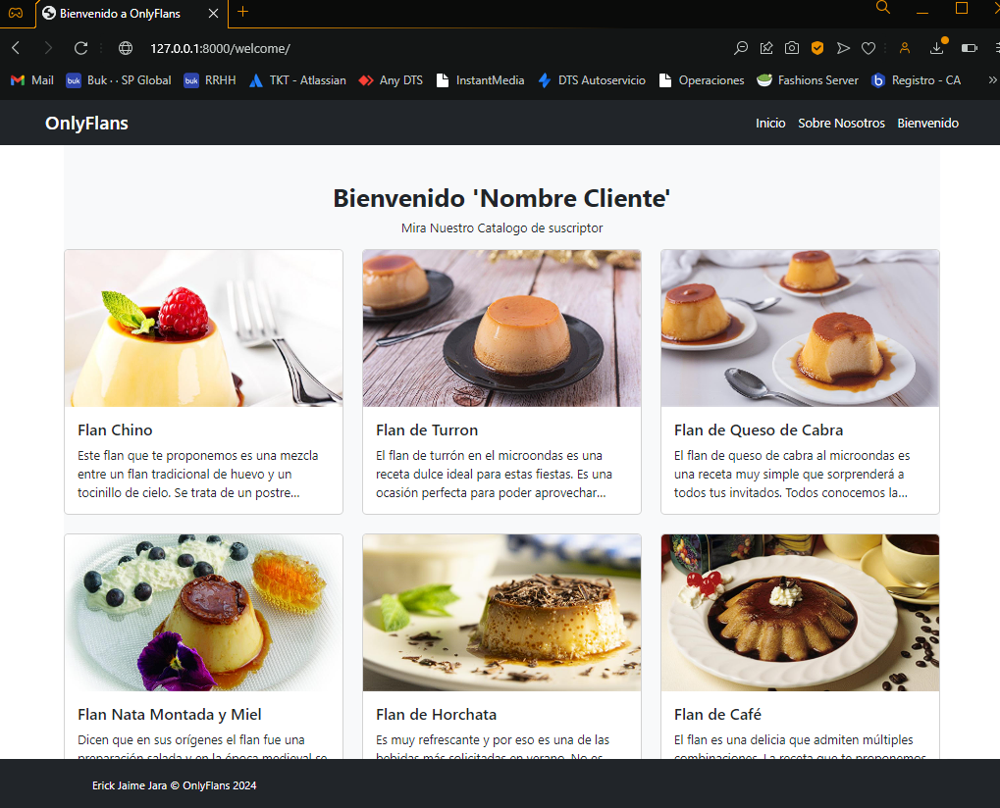
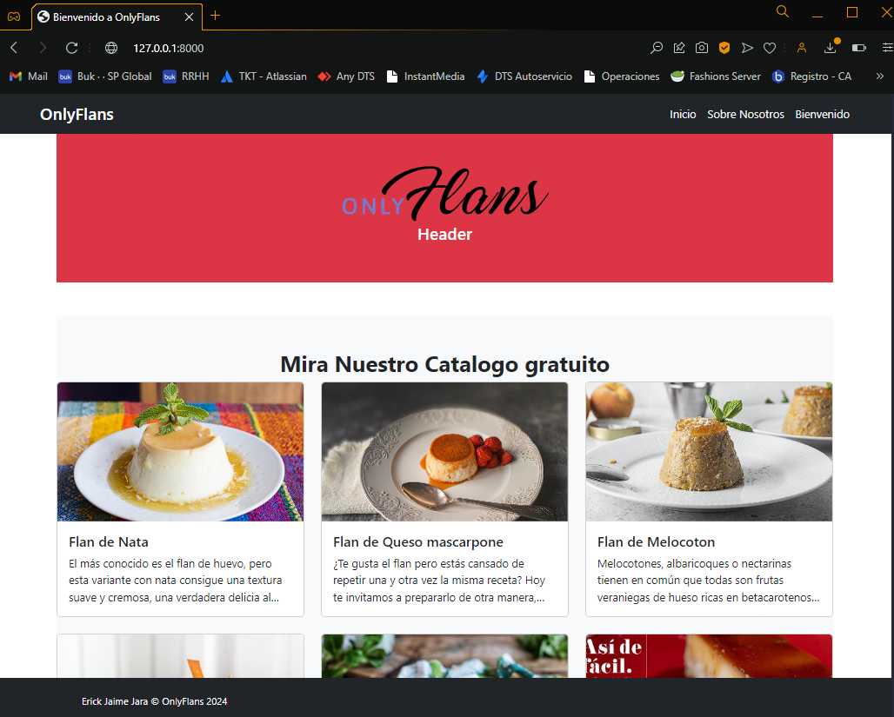
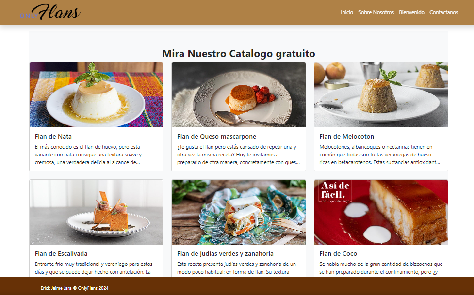
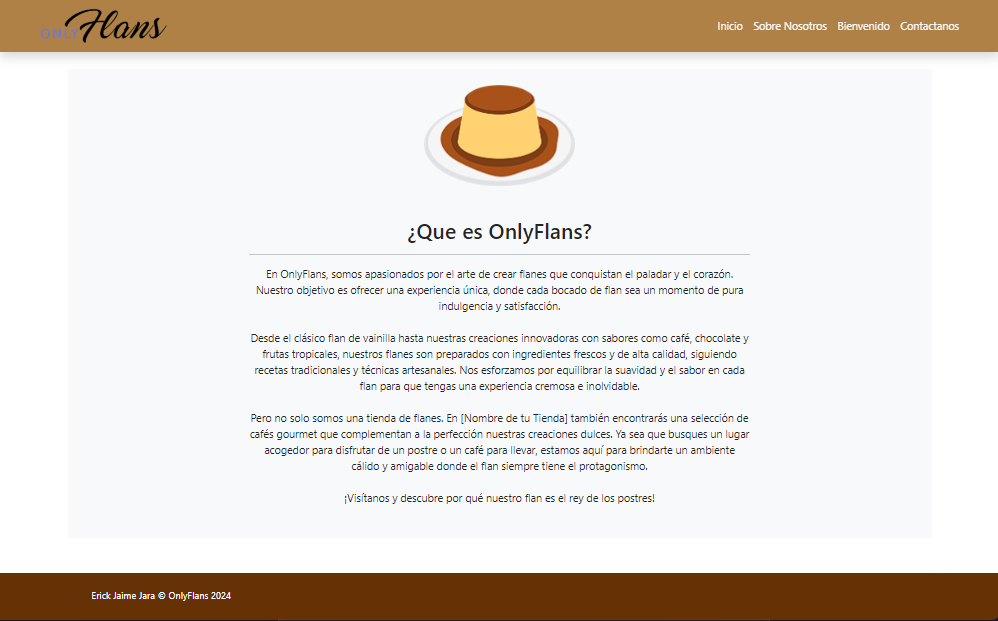
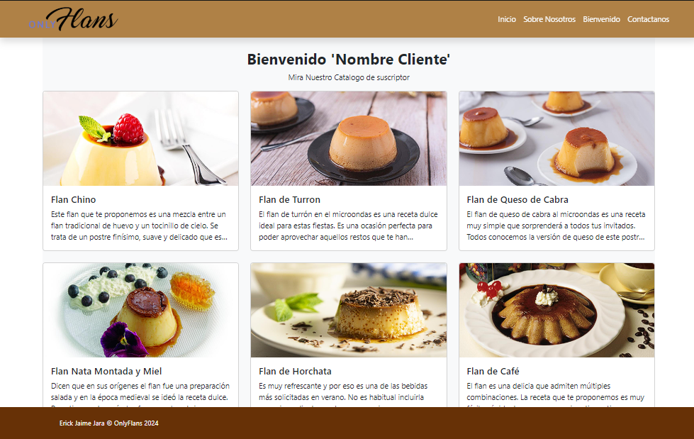
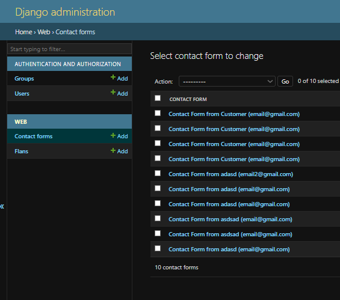
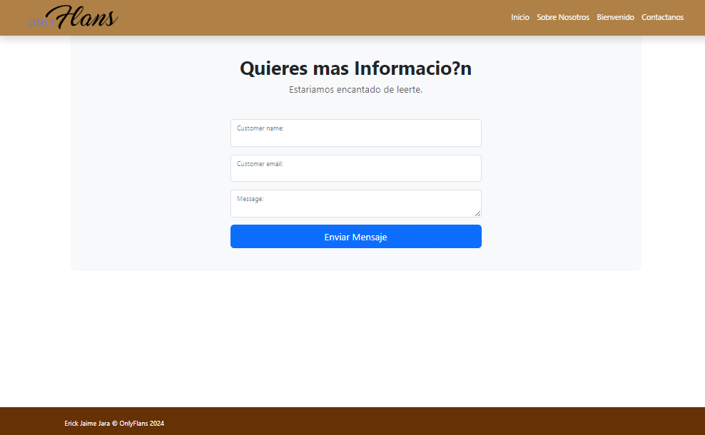
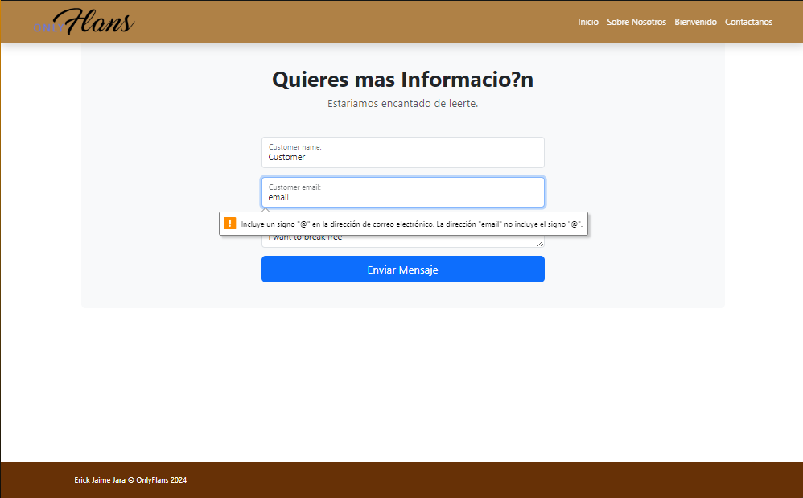
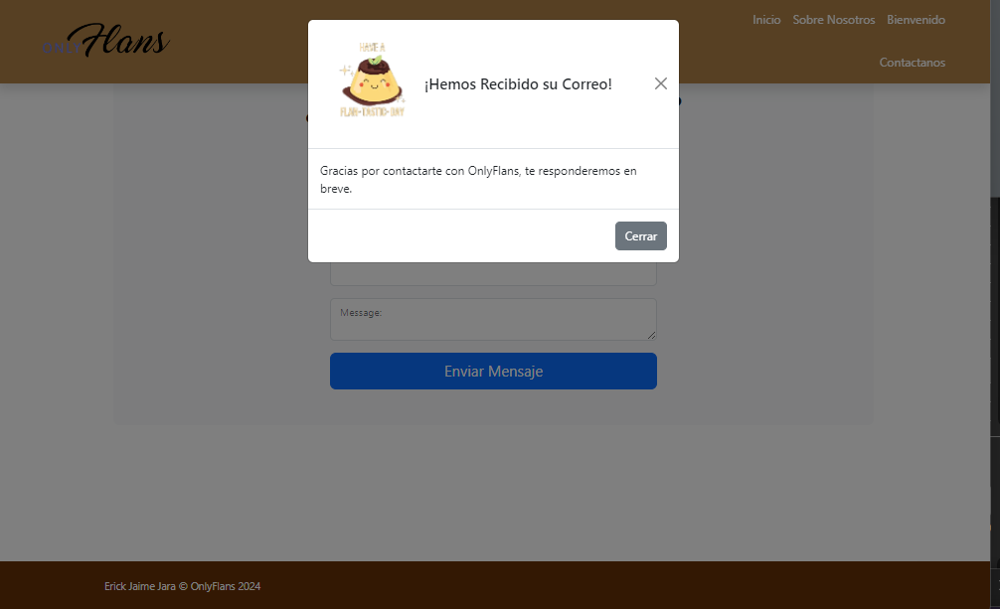

# OnlyFlans

## Descripción

Este proyecto está diseñado para gestionar una aplicación web utilizando Django y SQLite3. Está estructurado de manera que cada funcionalidad o hito se desarrolla en ramas separadas para facilitar el seguimiento y ser usado como punto de control.

## Estructura de Ramas

El proyecto utiliza un sistema de control de versiones con ramas en Git para organizar el desarrollo. Cada hito o funcionalidad solicitada se implementa en ramas específicas. A continuación se detalla la estructura de ramas:

- **main**: Rama principal que contiene la versión actual del proyecto.
- **hito-1**: Rama dedicada al primer hito solicitado (Levantando tu primer proyecto Django).
- **hito-2**: Rama dedicada a la preparacion del frontend de la aplicacion (Creación de un sitio web responsive con Bootstrap).


## Instalación

Para configurar el proyecto en tu máquina local, sigue estos pasos:

1. Clona el repositorio:

   ```bash
    git clone https://github.com/DevilAbbath/onlyflansPrj/tree/hito3
    cd tu_repositorio

2. Crea y activa un entorno virtual:

   ```bash
    python -m venv env
    source env/bin/activate  # En Windows usa `env\Scripts\activate`

3. Instala las dependencias:

   ```bash
    pip install -r requirements.txt

4. Aplica las migraciones:

   ```bash
    python manage.py migrate


5. Ejecuta el servidor:

   ```bash
    python manage.py runserver

---

## Resumen General

El proyecto requiere crear modelos de datos para "Flan" y "ContactForm" en Django, configurar las migraciones, el panel de administración, y las vistas para mostrar los datos en el sitio. También se pide configurar un formulario de contacto y una vista de éxito, y finalmente reemplazar el formulario con un ModelForm. Cada avance debe ser documentado con pantallazos para validación.


### Requerimiento 1: Crear modelo Flan
- **Definición del modelo**: Crea el modelo `Flan` con los siguientes campos:
  - `flan_uuid`: UUIDField (identificador único)
  - `name`: CharField (largo máximo 64 caracteres)
  - `description`: TextField
  - `image_url`: URLField
  - `slug`: SlugField
  - `is_private`: BooleanField
- **Migraciones**: Genera y aplica las migraciones correspondientes al modelo `Flan`.
- **Registro en Admin**: Agrega el modelo al panel de administración de Django.
- **Creación de Instancias**: Crea al menos 8 instancias de `Flan` en el panel de administración, con valores variados en el campo `is_private`.

#### Capturas de Pantalla
- **Requerimiento 1: Página de Administracion**




---

### Requerimiento 2: Mostrar Flanes en el Sitio Web
- **Página Principal**: En la ruta `/`, muestra solo los flanes públicos (`is_private=False`) usando el componente `card` de Bootstrap.
- **Página de Bienvenida**: En la ruta `/bienvenido`, muestra solo los flanes privados (`is_private=True`).
- **Capturas de Pantalla**: Toma pantallazos de ambas páginas con los flanes mostrados.


#### Resultado en Pantalla
- **Requerimiento 2.1: Index** 




- **Requerimiento 2.2: Welcome**



---

### Requerimiento 3: Crear modelo ContactForm
- **Definición del modelo**: Crea el modelo `ContactForm` con los siguientes campos:
  - `contact_form_uuid`: UUIDField (con valor por defecto `uuid.uuid4`, no editable)
  - `customer_email`: EmailField
  - `customer_name`: CharField (largo máximo 64 caracteres)
  - `message`: TextField
- **Vista de Contacto**: Crea una vista y una URL para la ruta `/contacto` que muestre el mensaje "Contacto".
- **Formulario de Contacto**: Configura un formulario en `forms.py` llamado `ContactFormForm` para recibir los datos de contacto y usa el token de seguridad ``.
- **Vista de Éxito**: Crea una vista de éxito que muestre un mensaje confirmando el envío del formulario.
- **Registro de Datos**: Configura el formulario para que los datos enviados se registren en el modelo `ContactForm`.
- **Capturas de Pantalla**: Documenta cada paso con pantallazos, incluyendo el formulario con datos correctos e incorrectos, y el registro de datos en el panel de administración.

#### Capturas de Pantalla
- **Requerimiento 3.1: Index**





- **Requerimiento 3.2: About**




- **Requerimiento 3.3: Welcome**




- **Requerimiento 3.4: Admin**




---

### Requerimiento 4: Reemplazar Formulario con ModelForm
- **Modelo basado en ModelForm**: Reemplaza el formulario `ContactFormForm` con un `ContactFormModelForm` que derive del modelo `ContactForm`.
- **Pruebas**: Realiza pruebas funcionales del formulario y toma pantallazos para validar el correcto funcionamiento.


#### Capturas de Pantalla
- **Requerimiento 4.1: Formulario Vacio**




- **Requerimiento 4.2: Form con Errores**




- **Requerimiento 4.3: Form Enviado Exito**




