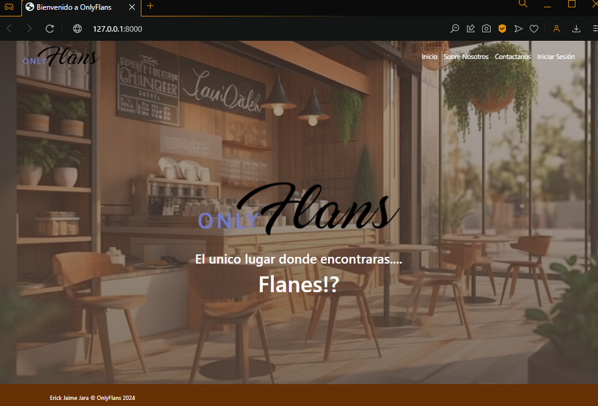
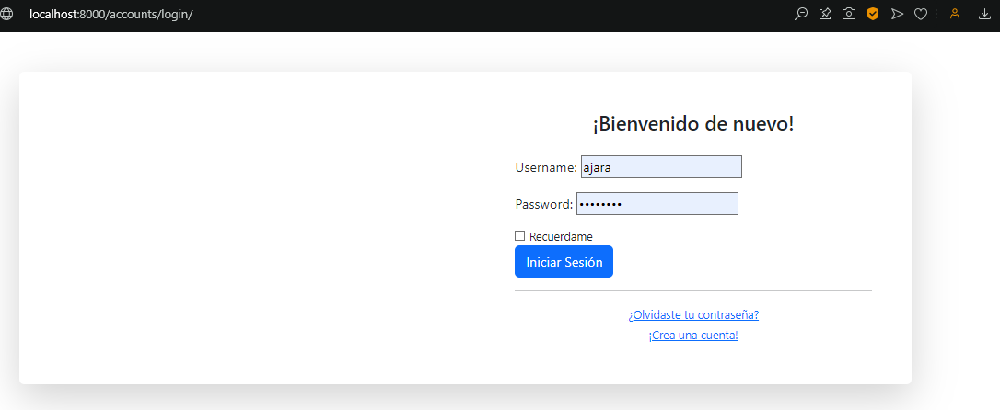
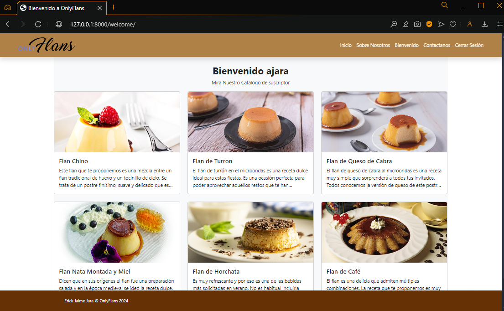
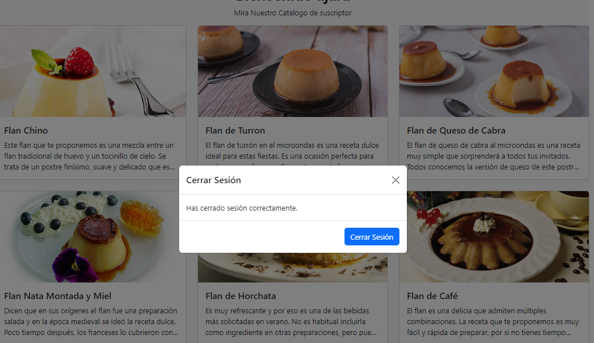
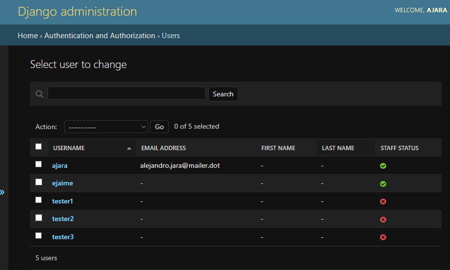
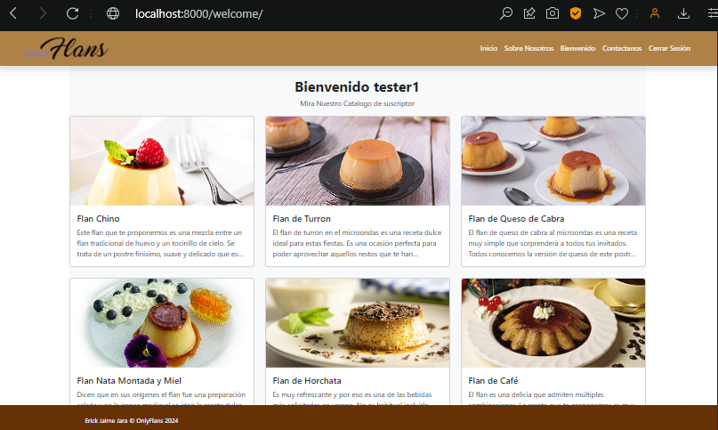
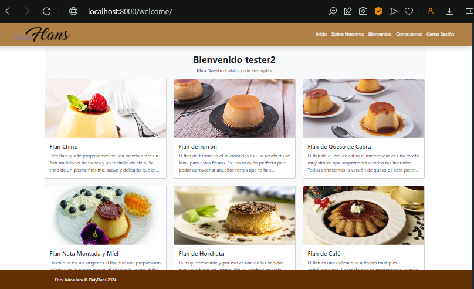
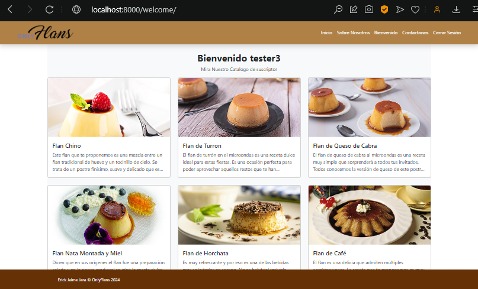

# OnlyFlans

## Descripción

Este proyecto está diseñado para gestionar una aplicación web utilizando Django y SQLite3. Está estructurado de manera que cada funcionalidad o hito se desarrolla en ramas separadas para facilitar el seguimiento y ser usado como punto de control.

## Estructura de Ramas

El proyecto utiliza un sistema de control de versiones con ramas en Git para organizar el desarrollo. Cada hito o funcionalidad solicitada se implementa en ramas específicas. A continuación se detalla la estructura de ramas:

- **main**: Rama principal que contiene la versión actual del proyecto.
- **hito-1**: Rama dedicada al primer hito solicitado (Levantando tu primer proyecto Django).
- **hito-2**: Rama dedicada a la preparacion del frontend de la aplicacion.
- **hito-3**: Rama dedicada a la preparacion del backend, preparacion de formularios y nuevos modelos. 
- **hito-4**: Rama dedicada a la aplicacion de una nueva caracteristica y presentacion.


## Instalación

Para configurar el proyecto en tu máquina local, sigue estos pasos:

1. Clona el repositorio:

   ```bash
    git clone https://github.com/DevilAbbath/onlyflansPrj/tree/hito3
    cd tu_repositorio

2. Crea y activa un entorno virtual:

   ```bash
    python -m venv env
    source env/bin/activate  # En Windows usa `env\Scripts\activate`

3. Instala las dependencias:

   ```bash
    pip install -r requirements.txt

4. Aplica las migraciones:

   ```bash
    python manage.py migrate


5. Ejecuta el servidor:

   ```bash
    python manage.py runserver

---

## Resumen General

Se implementaron mejoras en el sistema de autenticación del sitio web, habilitando las URLs de inicio y cierre de sesión de Django, y añadiendo botones correspondientes en el navbar. Además, se restringió el acceso a la página de Bienvenido solo a usuarios autenticados mediante el decorador login_required, y se personalizó el navbar para mostrar los enlaces de Bienvenido y Cerrar sesión solo a usuarios logueados. También se añadió un mensaje de bienvenida personalizado que muestra el nombre del usuario autenticado, utilizando {{ user.get_username }}, y se realizaron pruebas de inicio de sesión con tres usuarios creados desde el panel de administración. Estas mejoras optimizaron la navegación, la seguridad y la experiencia del usuario en el sitio web.


### Requerimiento 1: Autenticación de Usuario y Redirección
- **Habilitación de URLs de autenticación de Django**: Se activaron las URLs de login y logout de Django y se crearon plantillas personalizadas para el inicio y cierre de sesión.
- **Botones de login y logout en el navbar**: Se añadieron botones de inicio y cierre de sesión en el navbar para facilitar el acceso de los usuarios.
- **Redirecciones configuradas**: Se añadieron las configuraciones `LOGIN_REDIRECT_URL` y `LOGOUT_REDIRECT_URL` en `settings.py`, redirigiendo a los usuarios a la página de Bienvenido después de iniciar sesión, y a la página de Inicio al cerrar sesión.

#### Capturas de Pantalla
- **Requerimiento 1.1: Página de Inicio**



- **Requerimiento 1.2: Log In**



- **Requerimiento 1.3: Página de Usuario**



- **Requerimiento 1.4: Página Cierre Session**




---

### Requerimiento 2: Acceso Restringido a la Página de Bienvenido y Control de la Barra de Navegación
- **Restricción con `login_required`**: La página de Bienvenido está protegida mediante el decorador `login_required`, impidiendo el acceso a usuarios no registrados.
- **Condicionales en el navbar**: Se utilizaron condicionales `` en el navbar para mostrar solo el enlace de Bienvenido y Cerrar sesión a los usuarios autenticados. A su vez, el enlace de Iniciar sesión solo aparece cuando el usuario no ha iniciado sesión.
- **Personalización de vistas con Bootstrap**: Se implementaron elementos adicionales de Bootstrap para diferenciar visualmente las vistas de Inicio y Bienvenido, brindando una experiencia única en cada página.


#### Resultado en Pantalla
- **Requerimiento 2.1: Index** 


- **Requerimiento 2.2: Welcome**


---

### Requerimiento 3: Mensaje de Bienvenida Personalizado
- **Creación de múltiples usuarios**: Se crearon tres usuarios distintos en el panel de administración de Django para pruebas de autenticación en la web.
- **Mensaje de Bienvenida personalizado**: El mensaje de bienvenida en la página Bienvenido se personalizó para mostrar el nombre del usuario autenticado utilizando `{{ user.get_username }}`, de manera que el saludo refleje el nombre de cada usuario al iniciar sesión.

#### Capturas de Pantalla
- **Requerimiento 3.1: Añadir Usuarios al Panel de ADM**



- **Requerimiento 3.2: Bienvenidos {{Nombre Usuario}}**






