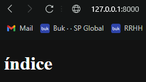
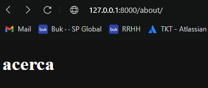
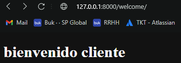
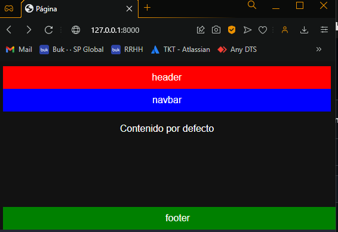
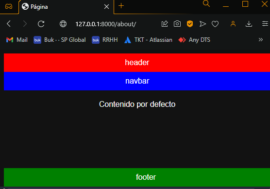
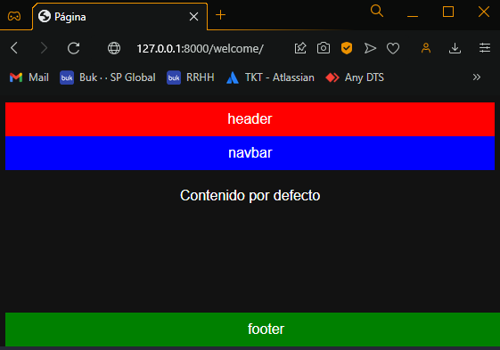
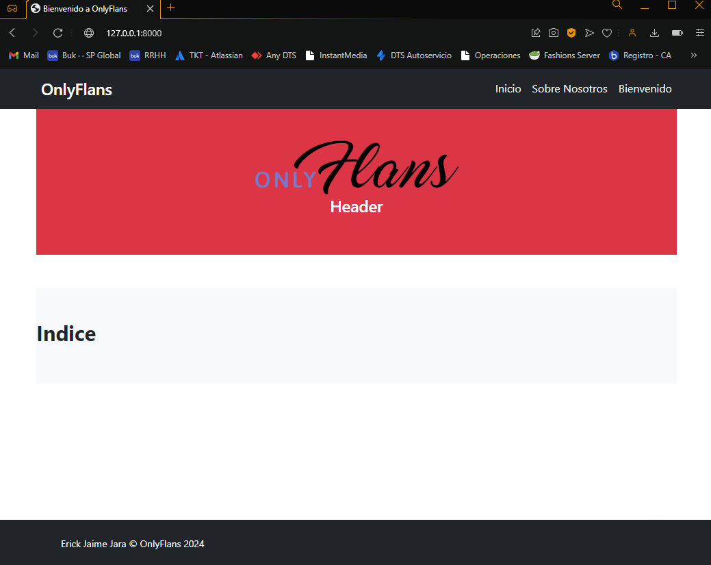
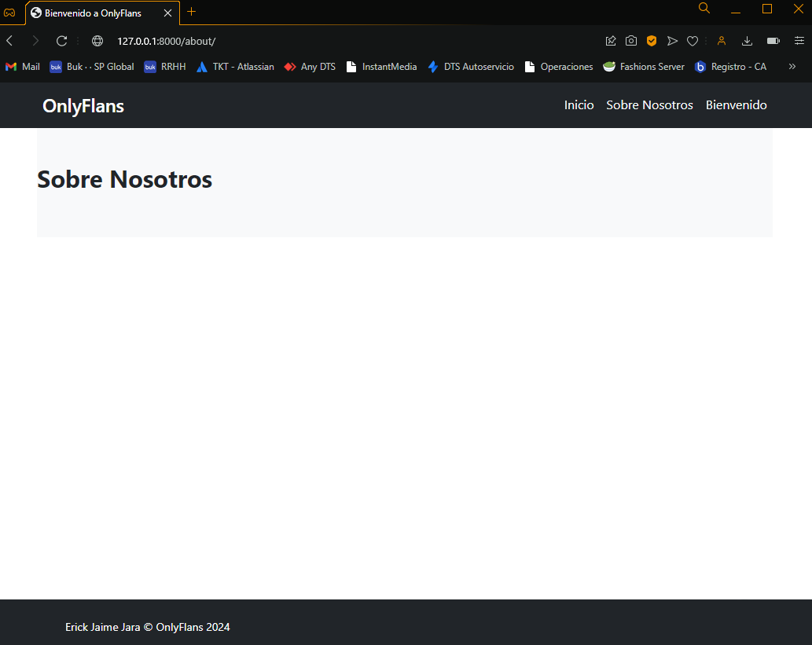
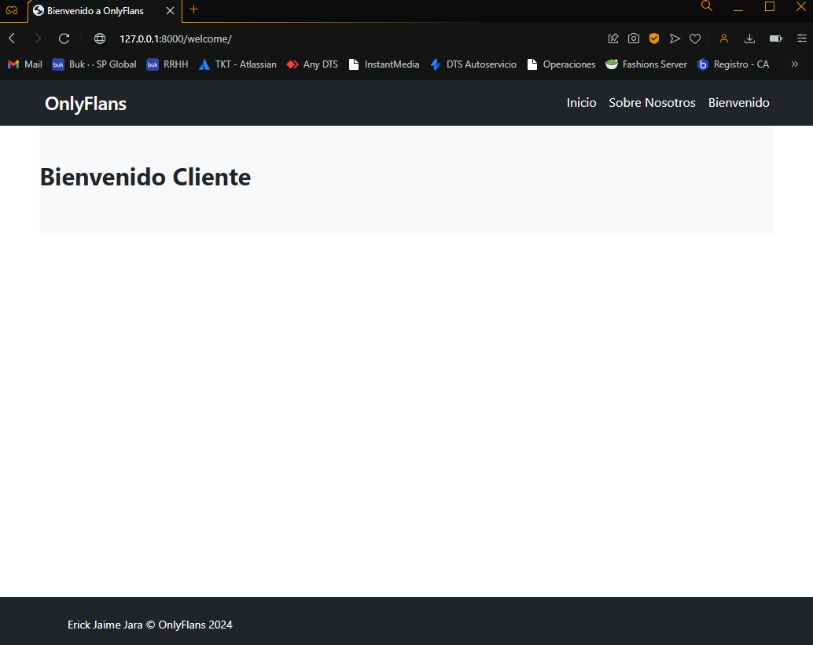

# OnlyFlans

## Descripción

Este proyecto está diseñado para gestionar una aplicación web utilizando Django y SQLite3. Está estructurado de manera que cada funcionalidad o hito se desarrolla en ramas separadas para facilitar el seguimiento y ser usado como punto de control.

## Estructura de Ramas

El proyecto utiliza un sistema de control de versiones con ramas en Git para organizar el desarrollo. Cada hito o funcionalidad solicitada se implementa en ramas específicas. A continuación se detalla la estructura de ramas:

- **main**: Rama principal que contiene la versión actual del proyecto.
- **hito-1**: Rama dedicada al primer hito solicitado (Levantando tu primer proyecto Django).
- **hito-2**: Rama dedicada a la preparacion del frontend de la aplicacion (Creación de un sitio web responsive con Bootstrap).


## Instalación

Para configurar el proyecto en tu máquina local, sigue estos pasos:

1. Clona el repositorio:

   ```bash
    git clone https://github.com/DevilAbbath/onlyflansPrj/tree/hito2
    cd tu_repositorio

2. Crea y activa un entorno virtual:

   ```bash
    python -m venv env
    source env/bin/activate  # En Windows usa `env\Scripts\activate`

3. Instala las dependencias:

   ```bash
    pip install -r requirements.txt

4. Aplica las migraciones:

   ```bash
    python manage.py migrate


5. Ejecuta el servidor:

   ```bash
    python manage.py runserver

---

## Requerimientos

### Requerimiento 1: Crear Rutas Básicas

**Resumen**: Habilitar las 3 URLs distintas con una plantilla básica que muestre solo texto. Esto implica:
- Mostrar el texto “índice” en la ruta `/`.
- Mostrar el texto “acerca” en la ruta `/acerca`.
- Mostrar el texto “bienvenido cliente” en la ruta `/bienvenido`.

#### Capturas de Pantalla
- **Requerimiento 1.1: Página de Índice**
  


- **Requerimiento 1.2: Página Acerca**


- **Requerimiento 1.3: Página Bienvenido Cliente**


---

### Requerimiento 2: Crear Plantilla Base

**Resumen**: Crear una plantilla base llamada `base.html` que contenga los elementos comunes a todas las rutas necesarias para el sitio web, incluyendo:
- Un `header` que muestre "header".
- Una `navbar` que muestre "navbar".
- Un `footer` que muestre "footer".
Además, utilizar colores de fondo para ayudar a visualizar la estructura.

#### Resultado en Pantalla
- **Requerimiento 2.1: Index**


- **Requerimiento 2.2: About**


- **Requerimiento 2.3: Welcome**


---

### Requerimiento 3: Implementar Bootstrap

**Resumen**: Integrar Bootstrap en la plantilla base, ajustando los estilos y el contenido para mejorar la apariencia del sitio web. Esto incluye:
- Cambiar el título de la página a "Bienvenido a OnlyFlans".
- Añadir la clase `container` a los elementos del `header`, `navbar`, `contenido` y `footer`.
- Reemplazar los contenidos de `header`, `navbar` y `footer` con componentes de Bootstrap.

#### Capturas de Pantalla
- **Requerimiento 3.1: Index**


- **Requerimiento 3.2: About**


- **Requerimiento 3.3: Welcome**



